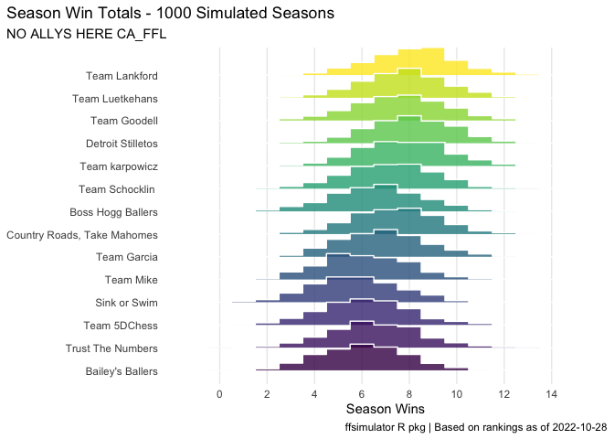
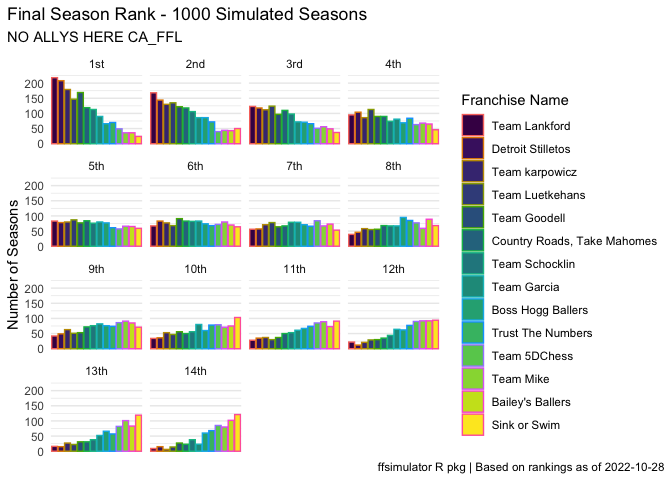

<!-- README.md is generated from README.Rmd. Please edit that file -->

# No Allys Here: 2022 Fantasy Football Season

<!-- badges: start -->
<!-- badges: end -->

This repository holds full season and weekly simulations for the No
Allys Here 2022 Fantasy Football season.

## Full Season Simulation

The overall results of simulating the 2022 season 1000 times are shown
below.

|          Metric          |                                     Team                                     | Value |
|:------------------------:|:----------------------------------------------------------------------------:|:-----:|
|   Wins (season median)   | Detroit Stilletos, Team 5DChess, Team Goodell, Team karpowicz, Team Lankford |   8   |
| Rank (most \#1 finishes) |                                 Team 5DChess                                 |  248  |
|  Points (weekly median)  |                                 Team 5DChess                                 |  88   |

### Wins

Distribution of total season wins for each team from 1000 simulations of
the 2022 season.

<!-- -->

### Final Ranking

Distribution of final ranking for each team from 1000 simulations of the
2022 season.

<!-- -->

### Total Points

Distribution of average number of weekly points for each team from 1000
simulations of 2022 season.

<!-- -->

## Weekly Simulations

| Week |              Link               |
|:----:|:-------------------------------:|
|  1   | [Simulation Result](/Week%201/) |
|  2   | [Simulation Result](/Week%202/) |
