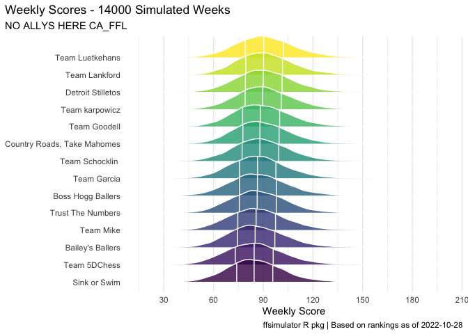

<!-- README.md is generated from README.Rmd. Please edit that file -->

# No Allys Here: 2022 Fantasy Football Season

<!-- badges: start -->
<!-- badges: end -->

This repository holds full season and weekly simulations for the No
Allys Here 2022 Fantasy Football season.

## Full Season Simulation

The overall results of simulating the 2022 season 1000 times are shown
below.

|          Metric          |                                      Team                                       | Value |
|:------------------------:|:-------------------------------------------------------------------------------:|:-----:|
|   Wins (season median)   | Detroit Stilletos, Team Goodell, Team karpowicz, Team Lankford, Team Luetkehans |   8   |
| Rank (most \#1 finishes) |                                  Team Lankford                                  |  218  |
|  Points (weekly median)  |                                 Team Luetkehans                                 |  91   |

### Wins

Distribution of total season wins for each team from 1000 simulations of
the 2022 season.

<!-- -->

### Final Ranking

Distribution of final ranking for each team from 1000 simulations of the
2022 season.

<!-- -->

### Total Points

Distribution of average number of weekly points for each team from 1000
simulations of 2022 season.

<!-- -->

## Weekly Simulations

| Week |               Link               |
|:----:|:--------------------------------:|
|  1   | [Simulation Result](/Week%201/)  |
|  2   | [Simulation Result](/Week%202/)  |
|  3   | [Simulation Result](/Week%203/)  |
|  4   | [Simulation Result](/Week%204/)  |
|  5   | [Simulation Result](/Week%205/)  |
|  6   | [Simulation Result](/Week%206/)  |
|  7   | [Simulation Result](/Week%207/)  |
|  8   | [Simulation Result](/Week%208/)  |
|  9   | [Simulation Result](/Week%209/)  |
|  10  | [Simulation Result](/Week%2010/) |
|  11  | [Simulation Result](/Week%2011/) |
