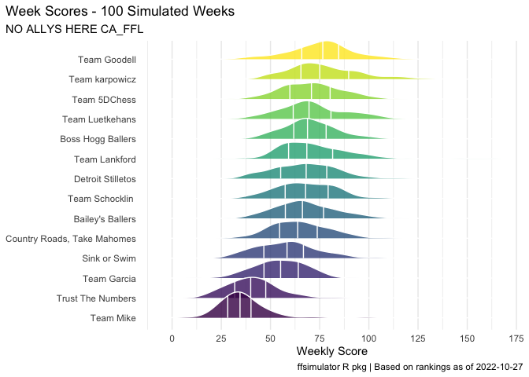

<!-- README.md is generated from README.Rmd. Please edit that file -->

# 2022 Fantasy Football Season: Week 8

<!-- badges: start -->
<!-- badges: end -->

The overall results of simulating Week 8 season 100 times are shown
below.

|        Metric         |       Team        | Value |
|:---------------------:|:-----------------:|:-----:|
|  Highest Points For   |   Team Goodell    |  77   |
| Lowest Points Against | Detroit Stilletos |  35   |

## Predicted Results

The predicted win/loss and points for Week 8 after 100 simulations.

<table class="table table-hover" style="width: auto !important; margin-left: auto; margin-right: auto;">
<thead>
<tr>
<th style="text-align:center;">
Team 1
</th>
<th style="text-align:center;">
Team 2
</th>
<th style="text-align:center;">
Team 1 Score
</th>
<th style="text-align:center;">
Team 2 Score
</th>
</tr>
</thead>
<tbody>
<tr>
<td style="text-align:center;">
Bailey’s Ballers
</td>
<td style="text-align:center;">
Trust The Numbers
</td>
<td style="text-align:center;">
66
</td>
<td style="text-align:center;">
40
</td>
</tr>
<tr>
<td style="text-align:center;">
Detroit Stilletos
</td>
<td style="text-align:center;">
Team Mike
</td>
<td style="text-align:center;">
68
</td>
<td style="text-align:center;">
35
</td>
</tr>
<tr>
<td style="text-align:center;">
Sink or Swim
</td>
<td style="text-align:center;">
Team Garcia
</td>
<td style="text-align:center;">
58
</td>
<td style="text-align:center;">
55
</td>
</tr>
<tr>
<td style="text-align:center;">
Team 5DChess
</td>
<td style="text-align:center;">
Boss Hogg Ballers
</td>
<td style="text-align:center;">
71
</td>
<td style="text-align:center;">
69
</td>
</tr>
<tr>
<td style="text-align:center;">
Team Goodell
</td>
<td style="text-align:center;">
Team Luetkehans
</td>
<td style="text-align:center;">
77
</td>
<td style="text-align:center;">
70
</td>
</tr>
<tr>
<td style="text-align:center;">
Team karpowicz
</td>
<td style="text-align:center;">
Country Roads, Take Mahomes
</td>
<td style="text-align:center;">
75
</td>
<td style="text-align:center;">
64
</td>
</tr>
<tr>
<td style="text-align:center;">
Team Lankford
</td>
<td style="text-align:center;">
Team Schocklin
</td>
<td style="text-align:center;">
68
</td>
<td style="text-align:center;">
68
</td>
</tr>
<tr>
<td style="text-align:center;">
Team Schocklin
</td>
<td style="text-align:center;">
Team Lankford
</td>
<td style="text-align:center;">
68
</td>
<td style="text-align:center;">
68
</td>
</tr>
</tbody>
</table>

## Predicted Points

Distribution of predicted number of points for Week 8 after 100
simulations.

